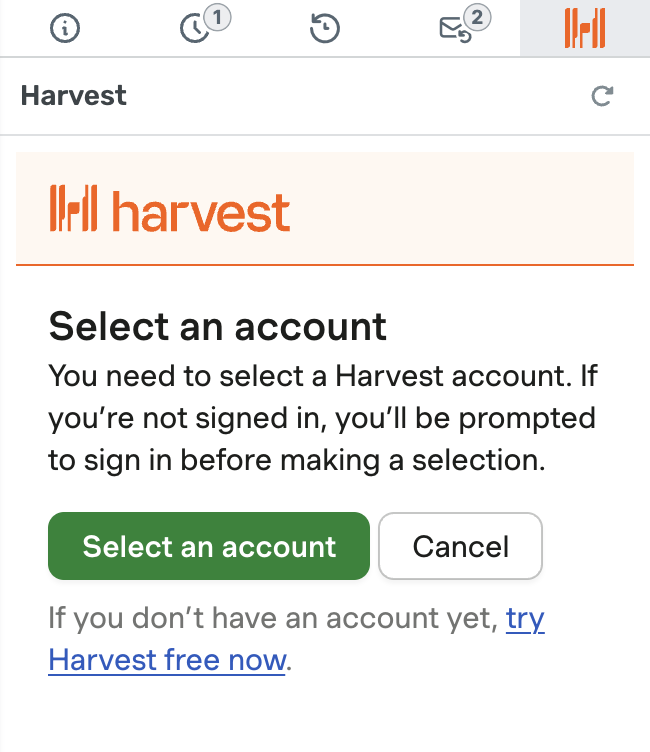

# Harvest Setup Instructions

Simply install the application, navigate to the ticket tab, and sign in.

If you'd like to map any Deskpro ticket values to a field in Harvest, you can easily do so within the settings tab
